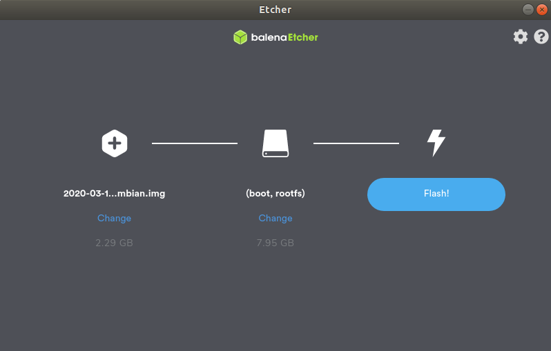

# IoMBian


## Introduction

IoMBian (or IoMBian OS) is the main operating system of the IoMBian project.
It has been developed mainly for teachers (educational environments), in order to facilitate the implementation of IoM (Internet of Machines) and IIoT (Industrial Internet of Things) systems in embedded devices (Raspberry Pi).
The initial configuration of the operating system has been simplified to the maximum for non-Linux experts, not being necessary to connect a monitor to the board or access to it by SSH to start working.


## Installation

The installation of the distribution is done in the same way as with any version of Raspbian.
These are the recommended steps to follow:

- Download Etcher from its [website](https://www.balena.io/etcher/).
- Download the latest version of IoMBian (.zip) from the ['Releases'](https://github.com/Tknika/iombian/releases) section.
- Insert the microSD card into the computer.
- Run Etcher, choose the IoMBian .zip file in "Select image", check that the selected microSD card is the right one and press the "Flash" button.
Wait a few minutes (< 5 minutes) until the process is over.

- Remove the microSD card and reinsert it into the computer's card reader.
- In the file browser, open the "boot" partition, enter the "config" folder, open the "parameters.yml" file with any text editor (in Windows, it is recommended to use [Notepad++](https://notepad-plus-plus.org/)) and edit the following parameters (more about this in [iombian-confinit](https://github.com/Tknika/iombian-confinit)):
  - system/hostname: ~~iombian~~ &rarr; iombian-aiturrioz
  - user/password: ~~iompi~~ &rarr; *your_password*
  - networking/wlan0/ssid: *wifi_network_name*
  - networking/wlan0/psk: *wifi_network_password*
- Remove the microSD card from the computer and insert it into the Raspberry Pi.
- Power up the Raspberry Pi with a suitable power supply (5V and 2.5A).
- That's all! :tada:

> To discover the services installed on the Raspberry Pi, see the section [IoMBian Discover](#iombian-discover).


## Software

IoMBian is based on the latest stable version of [Raspbian Lite](https://www.raspberrypi.org/downloads/raspbian/), to which the following programs have been added:

- [Node-RED](https://nodered.org/): a visual development tool, originally created by IBM, that allows to collect information from hardware devices, APIs and online services as part of the Internet of Things.
- [Mosquitto](https://mosquitto.org/): a widespread MQTT server (broker) developed by the Eclipse Foundation.
- [MQTT Web Client](https://github.com/hivemq/hivemq-mqtt-web-client): MQTT web client thanks to which the user (student) can send his first MQTT messages without having to install anything in his computer. Combined with the pre-installed mosquitto broker, it allows to start playing with the protocol in a few minutes.
- [Monit](https://mmonit.com/monit/): program that can monitor the state of the system and is capable of sending notifications to the user (by e-mail) when something does not work as expected.
- Led controller: configuration that allows to know if the Raspberry Pi is on or not through a LED connected to the GPIO14.
- [Shutdown controller](https://github.com/Tknika/iom2040-shutdown-controller): small script developed in Python that enables the Raspberry Pi to be switched on and off manually from a button connected to the GPIO3.
- [Samba](https://www.samba.org/cifs/docs/what-is-smb.html): protocol that simplifies file exchange between the Raspberry Pi and any computer on the local network. By default only the "/data" folder is shared (the folder name is case sensitive).
- [Confinit](https://github.com/jriguera/confinit): tool developed by José Riguera (@jriguera) that allows to configure the Raspberry Pi from a single text file hosted in the "boot" partition of the microSD card. A specific configuration has been created for IoMBian called [iombian-confinit](https://github.com/Tknika/iombian-confinit) that facilitates the configuration of the following services:
  - 'iompi' user's password (username cannot be changed)
  - Hostname
  - Locale
  - Timezone
  - Network (Wireless network parameters and the configuration for each interface -IP, mask, gateway,...-)
  - Node-RED
  - Mosquitto
  - Monit
  - ...
  - (For a more detailed explanation, please refer to the following [link](https://github.com/Tknika/iombian-confinit))


## IoMBian Discover

In addition, because the distribution is targeted at the educational sector, where more than a dozen devices are expected to be connected to the local network simultaneously, a desktop program has been developed to assist in locating these devices: [IoMBian Discover](https://github.com/Tknika/iombian-discover).
Thanks to this tool, the user can open the services installed on the Raspberry Pi (Node-RED, for example), without having to know the IP address or the port on which they are running.
For more information about the installation and configuration process of the program, visit the [program page](https://github.com/Tknika/iombian-discover).


## Development

While the operating system can be manually generated on any computer (it is based on the [pi-gen](https://github.com/RPi-Distro/pi-gen#config) project), this GitHub repository is set up to compile the image automatically through GitHub Actions.
To do this, you just need to create a new 'Release' (using the "Draft a new release" button, as the repository administrator) and in less than 30 minutes the 'Release' will be updated with the corresponding .zip file.

However, if you still want to compile the distribution locally, you can take the following steps (not recommended):

> Git and docker must be pre-installed on the local machine

```bash
git clone https://github.com/Tknika/iombian.git
```

```bash
cd iombian
```

```bash
./build-iombian.sh
```

After 30-60 minutes, the .img file will be available in the 'deploy' folder.


## Author

(c) 2020 [Tknika](https://tknika.eus/) ([Aitor Iturrioz](https://github.com/bodiroga))

Licensed under the Apache License, Version 2.0 (the "License");
you may not use this file except in compliance with the License.
You may obtain a copy of the License at

    http://www.apache.org/licenses/LICENSE-2.0

Unless required by applicable law or agreed to in writing, software
distributed under the License is distributed on an "AS IS" BASIS,
WITHOUT WARRANTIES OR CONDITIONS OF ANY KIND, either express or implied.
See the License for the specific language governing permissions and
limitations under the License.
